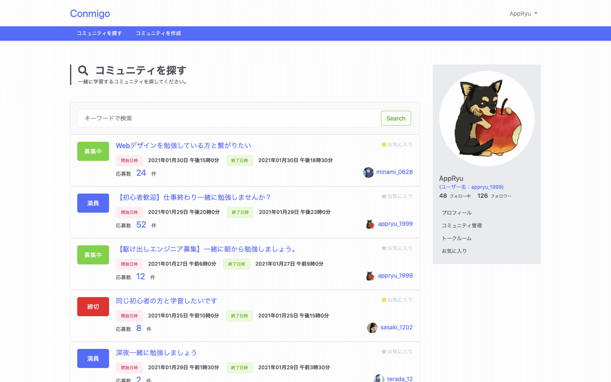

# Conmigo

## サービス名：Conmigo

Web サービス「Conmigo」は、現役エンジニア・駆け出しエンジニア・Web デザイナーの方々がもくもく会を開催もしくは参加し、一緒に学習する仲間を繋げ、共に学習を習慣化することを目的としたマッチングサービスです。

## 開発言語・フレームワーク・データベース

-   開発言語：HTML, CSS(SCSS), JavaScript, PHP
-   フレームワーク：Laravel, Vue.js, Bootstrap
-   データベース：MySQL
-   バージョン管理：Git, GitHub
-   デザインカンプ：PhotoShop
-   開発環境：docker
-   エディタ：Visual Studio Code

## 使用方法

1. コミュニティを主催する  
   画面上部のコミュニティ作成ページからコミュニティ名・開始日時・終了日時・コメント（学習を行うためのツール zoom,skype 等。スケジュール調整、求める学習仲間などの条件などを自由にお書きください）。  
   コミュニティ作成後、他ユーザーから応募があります。コミュニティ管理画面（企画済コミュニティ）ページから「仲間を選択する」から応募のあったユーザーの中から一緒に学習する仲間を選択します。選択後、自動でトークルームへ遷移します。ロークルームではビデオチャットツールの URL などを共有してください。そして指定の日時から学習をスタートしましょう。

2. コミュニティに参加する  
   コミュニティ一覧ページから参加したいコミュニティに応募します。応募後、コミュニティを作成したホストユーザーから選択された場合、トークルームがオープンされます。以後の操作は主催する側と同じです。

## 今後追加予定の機能

-   ダイレクトメッセージ
-   メール通知
